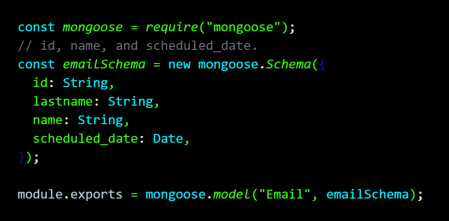
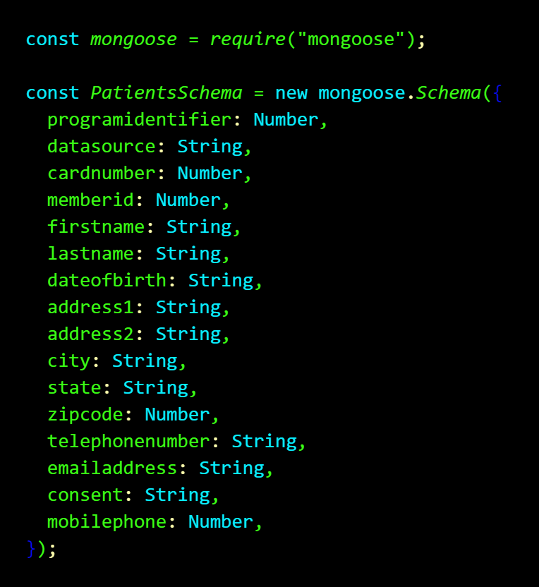
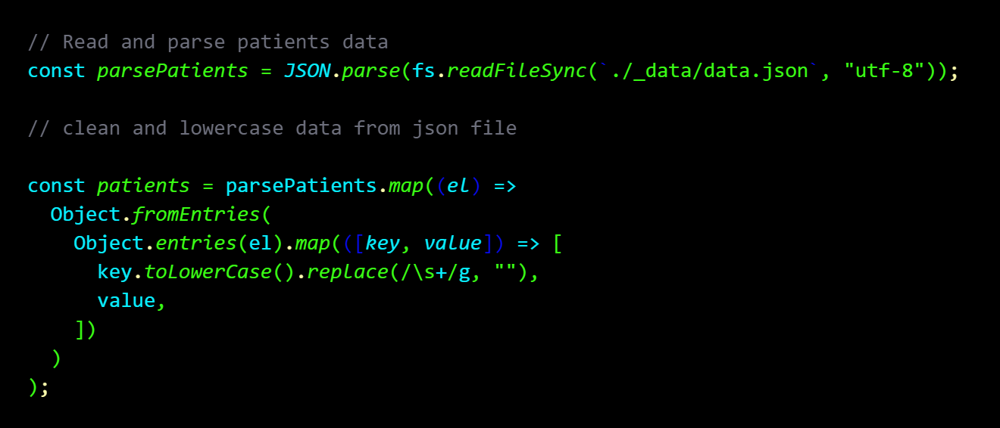
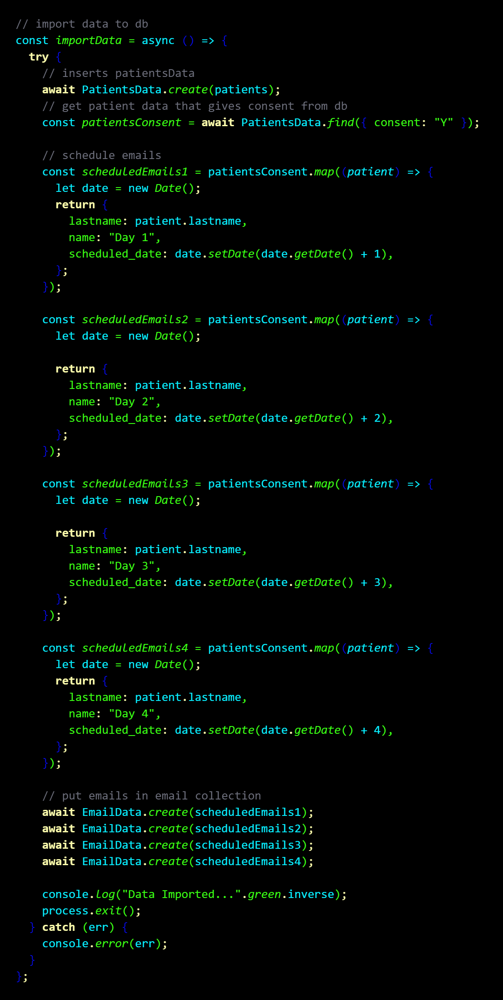
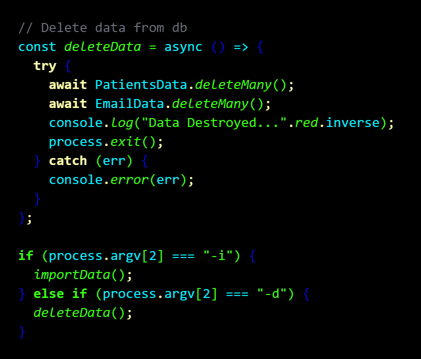
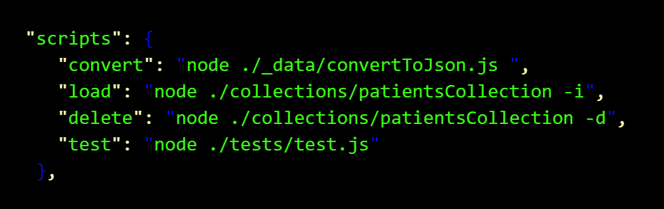

## Steps I took to compleat this tool

**After installing the packeges I needed like mongo db and mongoose**

## Screenshots

**I created a two Schemas and mongoose models one for Emails and one for all the Patient Data**

**New Project in mongod db**

**I parsed the CSV file to clean the data**

**Then I created a async function to load all the logic into the data base**

**I set up logic to delete the data base as well.**

**Then I set up functions to test if the database import was correct.**
**Tall the code is commented**

**then I set up scrips in the package.json**
mongod db\*\*

**I tested it and that is all folks!!**
