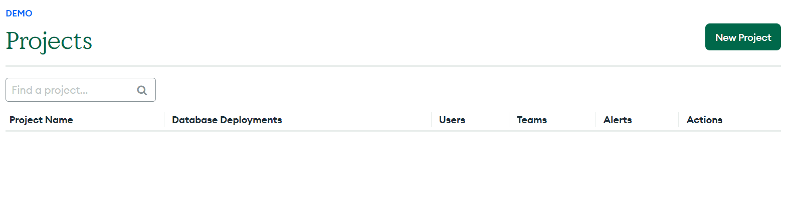
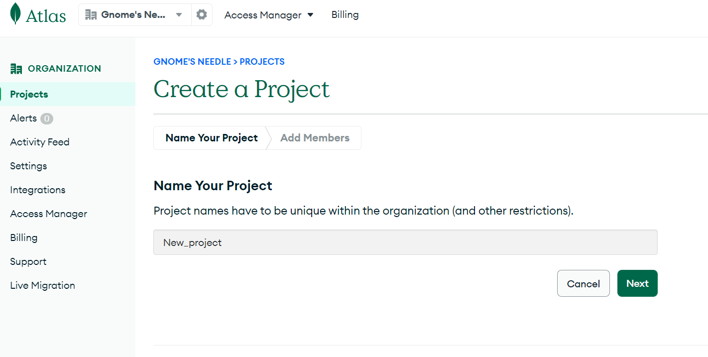
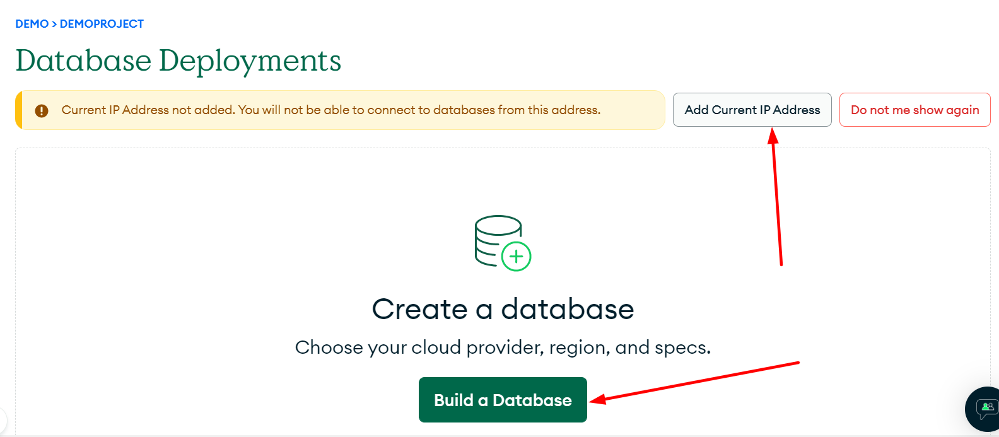
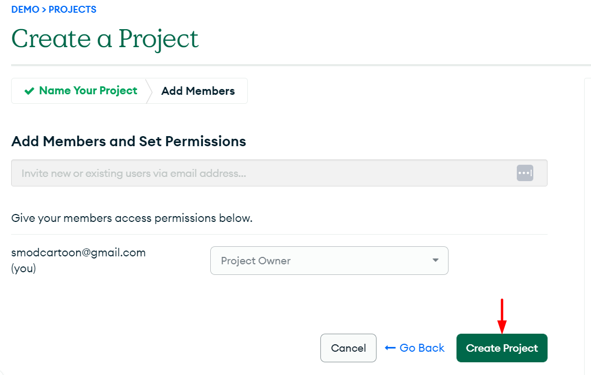
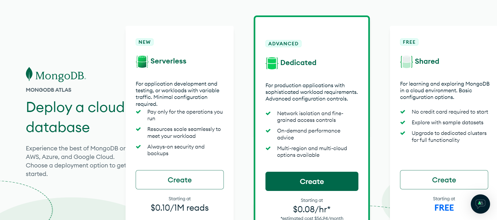
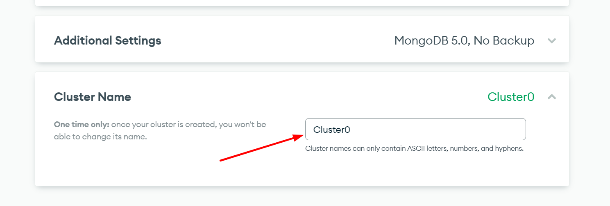
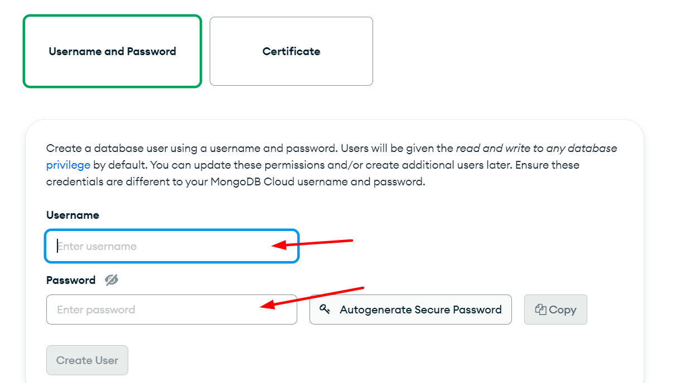
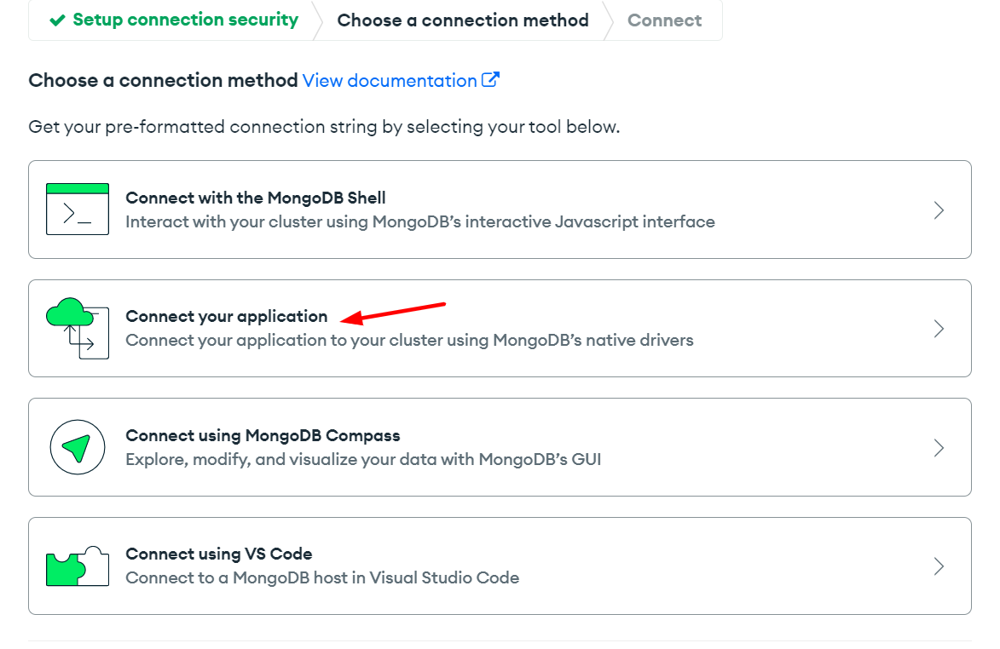
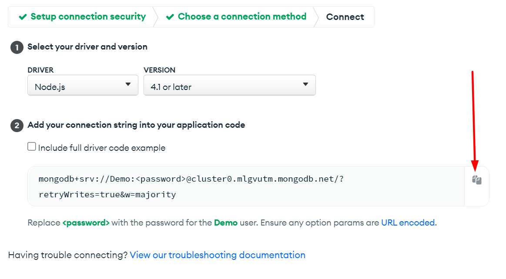
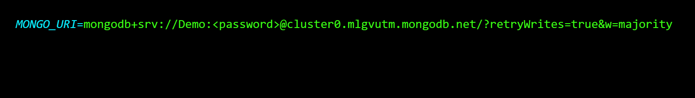

## Project title

**CSV Integration Tool for Mongo DB**

## Screenshots

Include logo/demo screenshot etc.

## Tech/NPM Packages

**Mongo DB**

**Mongoose**

**Dotenv**

**csv2json**

**Colors**

## Features

A tool that can load in csv files and schedule Emails in Mongo DB

## Code Example

Show what the library does as concisely as possible, developers should be able to figure out **how** your project solves their problem by looking at the code example. Make sure the API you are showing off is obvious, and that your code is short and concise.

## Installation

Download or Clone repo.

In Terminal run " npm install " to install packages from NPM.

Go to Mongodb.com (https://www.mongodb.com/) and start a account.

Make a new project.
**New Project in mongod db**

**Name your project**

**Add your IP to the database**

**Invite people or just create project**

**Choose your plan**

**Name your cluster**

**Make a username and password for your project**

**Invite people or just create project**

**Go to your database and connect and then press connect to your application**

**Copy the code and return to your code editor**

**Go to the config folder and past the code in the .env file and enter your password into the string**

## How to use?

First: In the terminal run the command {npm run convert} .

Second: run the command {npm run load} this will load the json file in the database and create the collections.

If you want to clear the database run the command {npm run delete} .

## Tests

to run all the test run the command {npm run test} all test will show in the terminal.

## License

A short snippet describing the license (MIT, Apache etc)

MIT © [Jonas Walden]()
